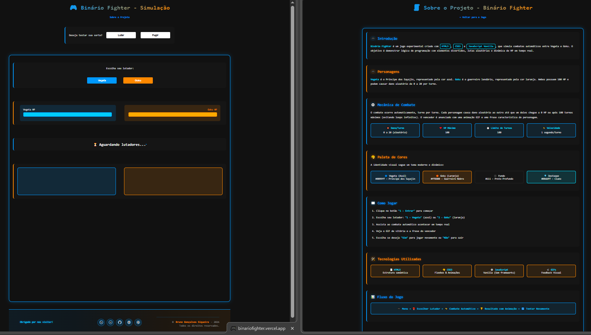
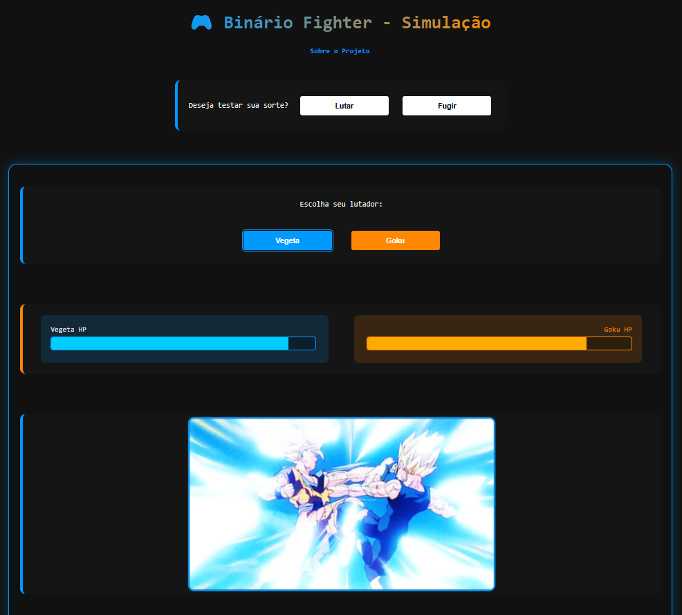
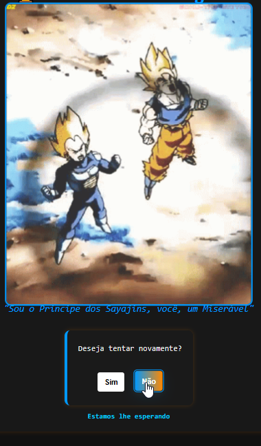

# Binário Fighter

Jogo simples de demonstração criado com HTML, CSS e JavaScript (Vanilla). Simula combates automáticos entre Vegeta e Goku e exibe GIFs de animação conforme o progresso.

## Estrutura principal
- `index.html` — entrada principal do jogo (arquivo na raiz do repositório).
- `src/sobre.html` — página "Sobre" (abreviação: detalhe do projeto).
- `src/js/script.js` — lógica do jogo (animações de GIF, simulação de combate, botões).
- `src/css/` — estilos divididos em `head.css`, `main.css`, `style.css`, `footer.css`, `sobre.css`.
- `src/img/` — imagens e GIFs usados pelo jogo.

## Como abrir
1. Abra `index.html` na raiz em um navegador moderno (Chrome/Edge/Firefox).
2. Recomenda-se fazer um hard-refresh (Ctrl+F5) se alterações de CSS/JS não aparecerem devido a cache.

## Testes rápidos
- Clique em "Lutar" → escolha "Vegeta" ou "Goku" → aguarde o combate automático.
- Ao final, ao clicar em "Sim", o fluxo será reiniciado (reset) e o próximo GIF de luta será mostrado.
- Ao clicar em "Não", o GIF de espera será exibido/alternado entre as animações de espera.

## Observações sobre caminhos e compatibilidade
- `index.html` está na raiz e referencia o script em `src/js/script.js`. As URLs de imagens dentro do JS (ex.: `src/img/gife02.gif`) são resolvidas em relação ao documento, portanto estão corretas para `index.html` na raiz.
- A página `src/sobre.html` carrega CSS com caminhos relativos (por exemplo `css/main.css`) — abra-a via `src/sobre.html` ou acessando pelo link "Sobre" na página principal.

## Ajustes feitos
- Centralização das regras `head/main/footer` em arquivos dedicados (`src/css/head.css`, `src/css/main.css`, `src/css/footer.css`).
- Correção e padronização de caminhos de imagens usados no JS.
- Sequência cíclica implementada para GIFs de espera e GIFs de luta conforme interações ("Não" e "Sim").

## Problemas comuns
- Se GIFs não carregarem: abra o DevTools (F12) e verifique o Console e a aba Network para erros 404 ou bloqueios.
- Se estilos não aplicarem: verifique a ordem dos arquivos CSS em `index.html` e faça hard-refresh.

## Créditos
Desenvolvido por Bruno Gonçalves Siqueira — 2026

---

## Screenshots

As imagens abaixo são placeholders gerados automaticamente. Substitua por capturas de tela reais colocadas em `src/img/` com os mesmos nomes e extensão `.png`.

- 
- 
- 